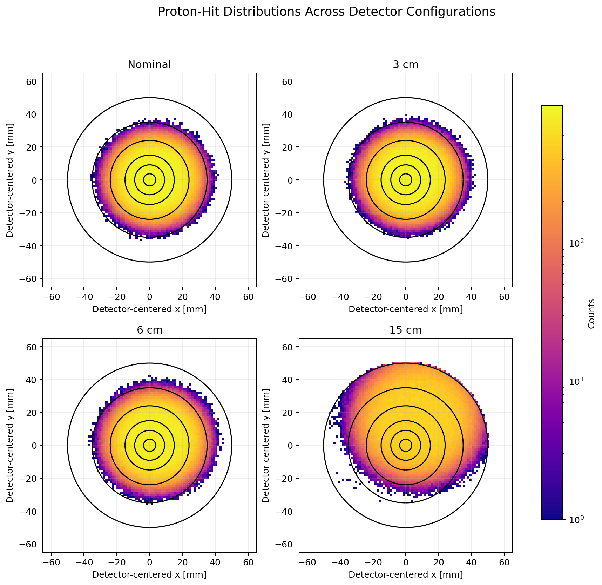
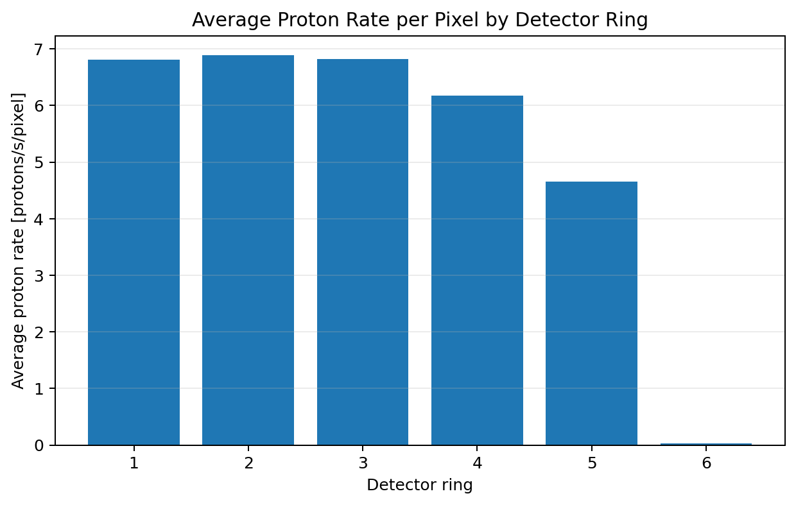
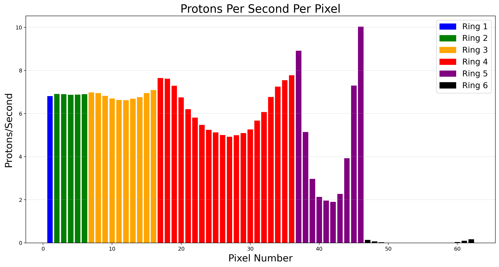

# Monte Carlo Particle Detector Analysis with Python

This project analyzes Monte Carlo simulations of proton hits on a segmented silicon detector for the BL3 neutron-lifetime experiment. I examine how changing the detector position affects the spatial distribution of proton hits and how those hits are distributed across the detector’s six-ring, 62-pixel geometry.

The analysis processes approximately **four million simulated events** stored in CERN ROOT files using Python, `uproot`, NumPy, pandas, and Matplotlib.



## Analysis questions

This project investigates three questions:

1. How does moving the detector away from its nominal position affect the location and spread of proton hits?
2. How are proton rates distributed across the detector’s six concentric rings?
3. What pixel-level variation is hidden when detector response is summarized using ring averages?

## Key findings

* Moving from the nominal to the 15 cm configuration shifted the center of the proton-hit distribution and increased its spatial spread.
* Between the nominal and 15 cm configurations, the standard deviation increased by approximately **30% along x** and **32% along y**.
* The first five detector rings received average rates between approximately **4.65 and 6.89 protons/s per pixel**, while the outermost ring received only **0.033 protons/s per pixel**.
* Pixel-level analysis revealed variation that is not visible from ring averages alone, particularly in the detector’s outer regions.

## Analysis workflow

The simulation data are stored in ROOT files. I use `uproot` to read the event data directly into Python and NumPy for the numerical analysis.

The workflow includes:

* processing approximately **1,000,000 simulated events per configuration**;
* selecting events with nonzero silicon energy deposition (`SiEdep > 0`);
* transforming global hit coordinates into a detector-centered coordinate system;
* comparing proton-hit distributions at the **Nominal, 3 cm, 6 cm, and 15 cm** configurations;
* converting Cartesian hit coordinates into radial and angular coordinates;
* assigning nominal-position hits to **6 detector rings and 62 individual pixels** using vectorized NumPy operations;
* estimating ring- and pixel-level proton rates using a normalization of **280 protons/s**.

## Detector geometry

The detector is divided into six concentric rings with radial boundaries at:

`3.7, 9.1, 15, 24, 35, and 50 mm`

The rings contain:

`1, 5, 10, 20, 10, and 16 pixels`

for a total of **62 detector pixels**. Angular offsets determine how pixels are positioned within each ring.

## Spatial-distribution results

For the spatial comparison, I select events with nonzero silicon energy deposition and display hits within the detector’s **50 mm outer radius**. All four histograms use the same coordinate range, binning, and logarithmic count scale so that the configurations can be compared directly.

| Configuration | SiEdep > 0 events | x mean (mm) | y mean (mm) | x std (mm) | y std (mm) |
| ------------- | ----------------: | ----------: | ----------: | ---------: | ---------: |
| Nominal       |           921,380 |      3.0896 |      0.5265 |    13.1289 |    12.4572 |
| 3 cm          |           920,867 |      2.9834 |      1.5073 |    13.3788 |    12.6537 |
| 6 cm          |           921,476 |      4.0090 |      3.1669 |    13.8189 |    13.0452 |
| 15 cm         |           921,449 |      7.0866 |     15.6059 |    17.0067 |    16.4103 |

The number of events producing silicon energy deposition remains nearly constant across the four configurations. However, the location and shape of the hit distribution change as the detector is displaced.

The largest change occurs in the 15 cm configuration. Relative to the nominal position, the mean x-coordinate increases from **3.09 to 7.09 mm**, while the mean y-coordinate increases from **0.53 to 15.61 mm**. The x and y standard deviations increase by approximately **30% and 32%**, respectively, showing that the distribution becomes substantially broader.

## Ring-level analysis

At the nominal detector position, I convert each valid hit into radial and
angular coordinates and assign hits to the detector's six rings.



| Ring | Number of pixels | Hit count | Average hits per pixel | Protons/s per pixel |
| ---: | ---------------: | --------: | ---------------------: | ------------------: |
|    1 |                1 |    22,401 |               22,401.0 |              6.8075 |
|    2 |                5 |   113,354 |               22,670.8 |              6.8895 |
|    3 |               10 |   224,332 |               22,433.2 |              6.8173 |
|    4 |               20 |   406,465 |               20,323.3 |              6.1761 |
|    5 |               10 |   153,070 |               15,307.0 |              4.6517 |
|    6 |               16 |     1,758 |                  109.9 |              0.0334 |

The first three rings receive similar average proton rates per pixel. The rate begins to decrease in Rings 4 and 5 and falls sharply in Ring 6, indicating that relatively few nominal-position hits reach the detector’s outermost region.

## Pixel-level analysis

Ring averages can conceal differences among individual pixels. To examine this structure, I assign every valid nominal-position hit to one of the detector’s 62 pixels.

The implementation uses vectorized NumPy operations rather than an event-by-event Python loop. Pixel assignments are calculated simultaneously within each detector ring using radial boundaries, angular offsets, and the number of pixels in that ring.



The pixel-level results reveal variation that is hidden by ring averages, especially in the outer portions of the detector. This demonstrates why analyzing the detector at both ring and pixel resolution provides a more complete description of its simulated response.

## Reproducibility

The notebook is organized into reusable functions for:

* loading and validating ROOT data;
* selecting detector-hit events;
* transforming coordinates;
* calculating summary statistics;
* assigning hits to detector rings;
* mapping hits to individual pixels;
* calculating normalized proton rates;
* generating portfolio figures.

The notebook can be executed sequentially from top to bottom after the four simulation files are placed in the local `data/` directory.

## Repository structure

```text
particle-detector-analysis/
├── particle_detector_analysis.ipynb
├── README.md
├── requirements.txt
├── .gitignore
├── data/
│   └── README.md
└── figures/
    ├── detector_configuration_comparison.png
    └── nominal_pixel_rates.png
```

## Running the analysis

Create and activate a Python virtual environment:

```bash
python3 -m venv .venv
source .venv/bin/activate
```

Install the required packages:

```bash
pip install -r requirements.txt
```

Place the four ROOT files in the `data/` directory and launch JupyterLab:

```bash
jupyter lab
```

Open `particle_detector_analysis.ipynb` and run the notebook from top to bottom. The notebook also generates the two figures displayed in this README.

## Data availability

The analysis uses four ROOT simulation files corresponding to the Nominal, 3 cm, 6 cm, and 15 cm detector configurations.

The files are excluded from Git because of their size and because raw research data should only be redistributed when permission is clear. The expected filenames and directory structure are documented in `data/README.md`.

## Tools

**Python · NumPy · pandas · Matplotlib · uproot · Jupyter · CERN ROOT data**
